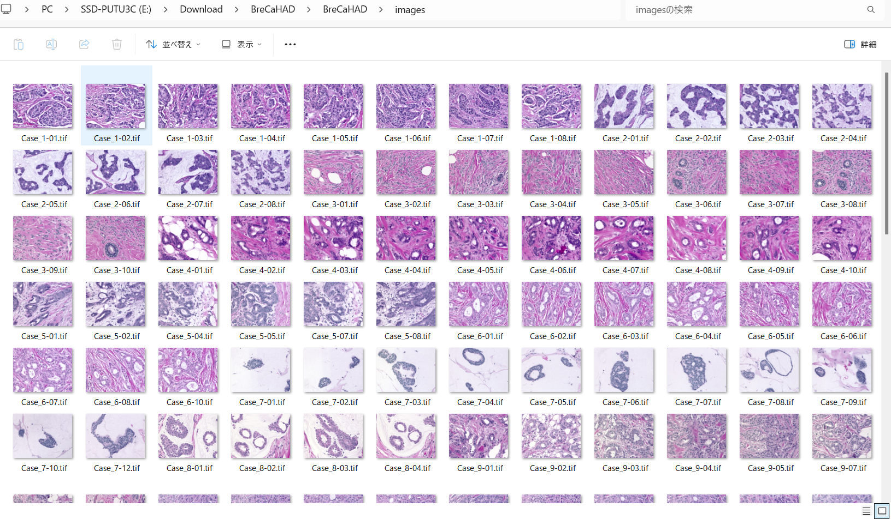
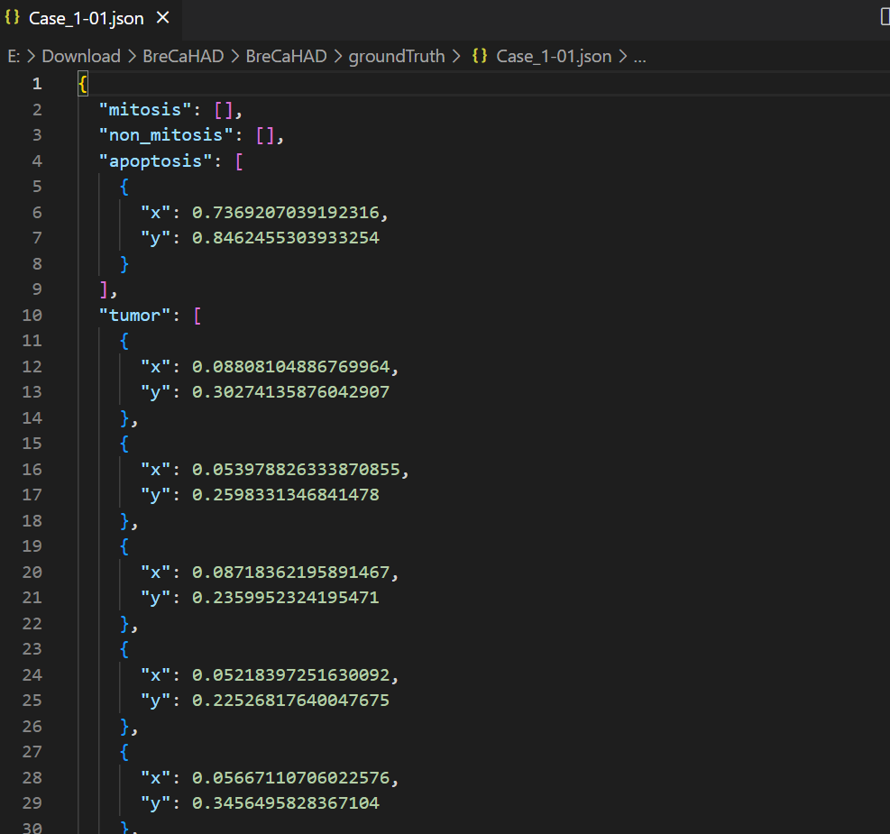
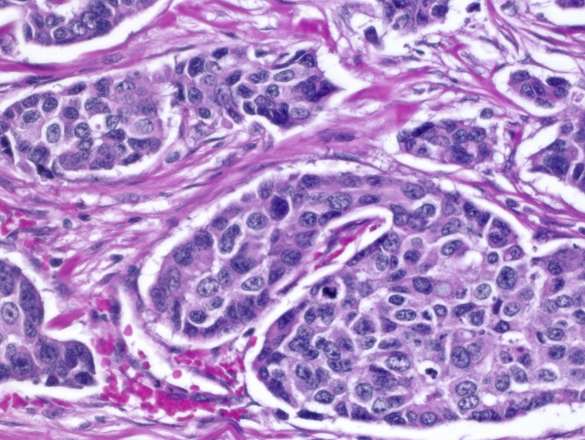
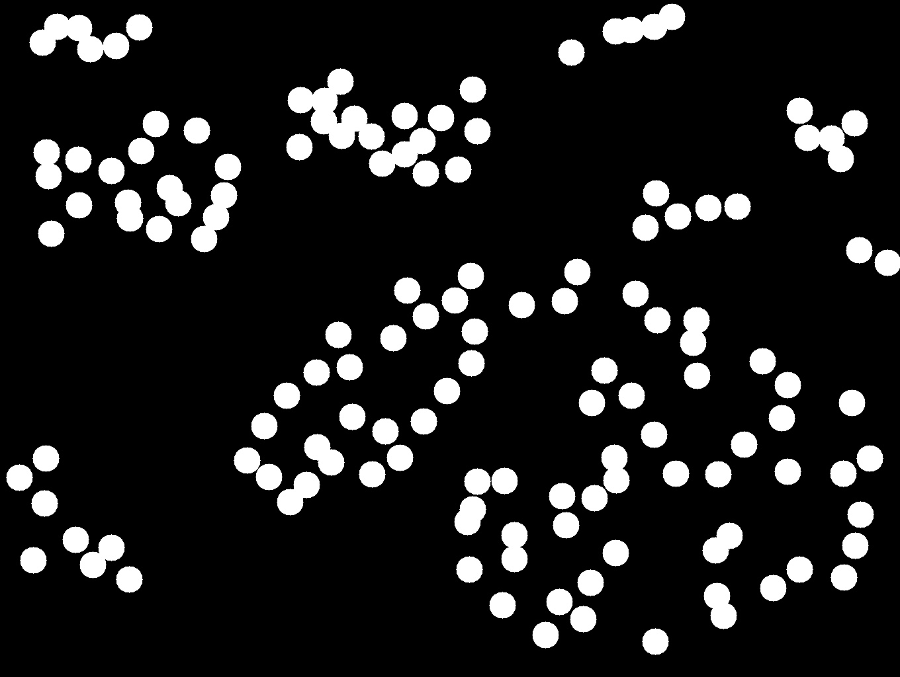
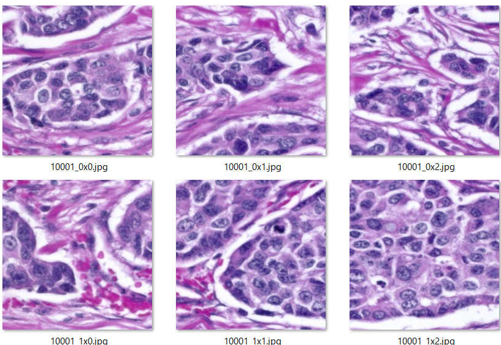
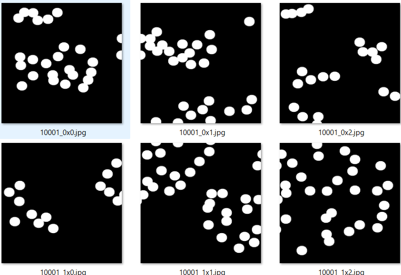
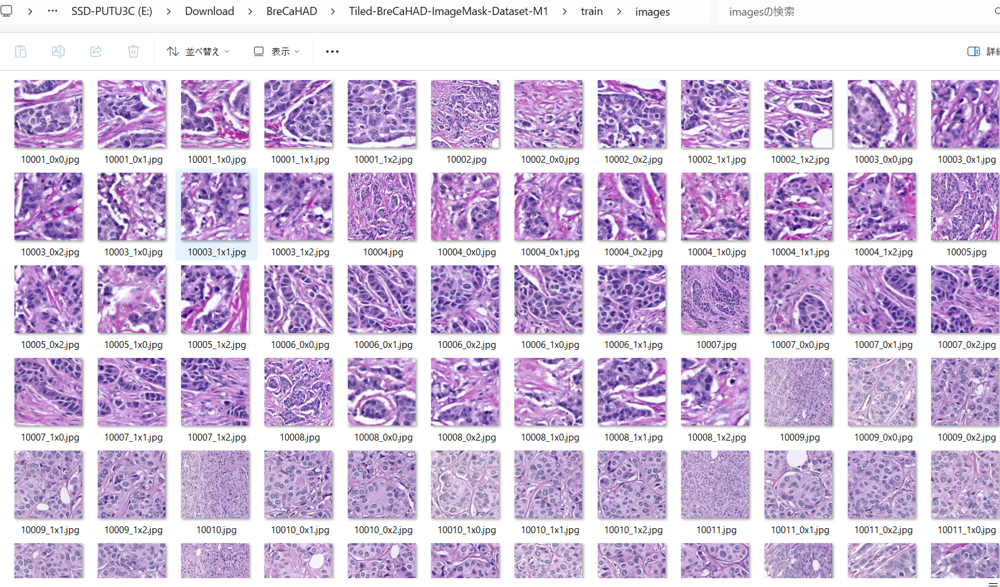
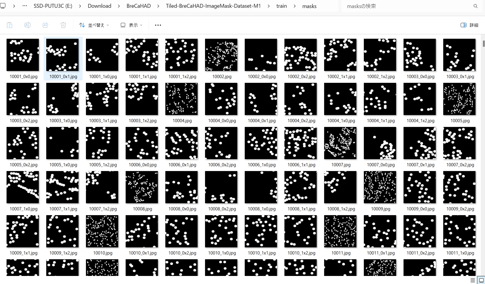
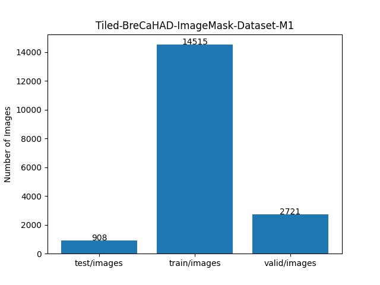

<h2>Tiled-ImageMask-Dataset-BreCaHAD (2024/08/04)</h2>

This is Tiled-ImageMask Dataset for BreCaHAD: A Dataset for Breast Cancer Histopathological Annotation and Diagnosis. 
The dataset used here has been taken from the following web-site 
<b>BreCaHAD: A Dataset for Breast Cancer Histopathological Annotation and Diagnosis</b> 
 
<a href="https://figshare.com/articles/dataset/BreCaHAD_A_Dataset_for_Breast_Cancer_Histopathological_Annotation_and_Diagnosis/7379186">
https://figshare.com/articles/dataset/BreCaHAD_A_Dataset_for_Breast_Cancer_Histopathological_Annotation_and_Diagnosis/7379186
</a>
 

 

<b>Download Tiled-ImageMask-Dataset</b> 
You can download our dataset from the google drive 
<a href="https://drive.google.com/file/d/1ppmWc-AxMFZeiu66_GwTFJ5lgHc-y3jz/view?usp=sharing">
Tiled-BreCaHAD-ImageMask-Dataset-M1.zip</a>
 

<h3>1. Dataset Citation</h3>
Aksac, Alper; Demetrick, Douglas J.; Özyer, Tansel; Alhajj, Reda (2019).  
BreCaHAD: A Dataset for Breast Cancer Histopathological Annotation and Diagnosis.  
figshare. Dataset. https://doi.org/10.6084/m9.figshare.7379186.v3
 
DOI:https://doi.org/10.6084/m9.figshare.7379186.v3 
 
<b>Version 3</b> 

Dataset posted on 2019-01-28, 23:22  
authored by Alper Aksac, Douglas J. Demetrick, Tansel Özyer, Reda Alhajj 

<b>License</b>: CC BY 4.0  

<h3>2. ImageMaskDataset Generation</h3>
<h3>2.1 Download BreCaHAD dataset</h3>

Please download the master BreCaHAD  from figshare website.  
<a href="https://figshare.com/articles/dataset/BreCaHAD_A_Dataset_for_Breast_Cancer_Histopathological_Annotation_and_Diagnosis/7379186">
BreCaHAD: A Dataset for Breast Cancer Histopathological Annotation and Diagnosis
</a>
 
<pre>
./BreCaHAD
├─groundTruth
│  ├─Case_1-01.json
...
│  └─Case_17-12.json
└─images
    ├─Case_1-01.tif
...    
    └─Case_17-12.tif
</pre>
<b>Case tif images:</b> 
 
 
The groundTruth json annotation files contain the following classes: 
<pre>
mitosis
non_mitosis
apoptosis
tumor
non_tumor
lumen
non_lumen
</pre>
For simplicity, we use <b>tumor</b> annotations only to create our mask image files. 
The Case json file contains a list of center-like (x,y) points for all cells belonging to the classes as shown below.
 
<b>Case json file:</b> 
 
 
As shown above, each x and y are normalized to take a value in range [0, 1.0], so you have to convert those values to actual (x, y) 
coordinates corresponding to each tissue image to create a mask file. 
We generated mask image files from (x, y) point-wise annotations by drawing filled circles with a constant radius 
around the center-like (x, y) positions. 
Consequently, the created mask dataset does not accurately represent the entire tumor region and can be considered a pseudo mask dataset.
 2.2 Generate BreCaHAD-master dataset</h3> 
Please run the following command for Python script <a href="./ImageMaskDatasetGenerator.py">
ImageMaskDatasetGenerator.py</a>.
 

This command generates 1360x1024 pixel-size BreCaHAD-master from the master BreCaHAD by offline augmentation methods 
in ImageMaskDatasetGenerator.py. 
<pre>
./BreCaHAD-master
├─images
└─masks
</pre>

The number of the original Tissue-images in BreCaHAD is only 162, and too small to use for a 
training set of a segmentation model. Therefore, in order to increase the number of the training data, 
we applied the following data augmentation methods to the original set. 
<li>horizontal flipping</li>
<li>vertical flipping</li>
<li>deformation</li>
<li>distortion</li>
<li>barrel_distortion</li>
<li>pincushion_distortion</li>
 
On more detail of these methods, please refer to <a href="./ImageMaskDatasetGenerator.py">ImageMaskDatasetGenerator.py</a>. 
 
<h3>2.3 Generate Tiled ImageMask Dataset </h3>

Please run the following command for Python script <a href="./TiledImageMaskDatasetGenerator.py">
TiledImageMaskDatasetGenerator.py</a>.
 
<pre>
> python TiledImageMaskDatasetGenerator.py
</pre>
This command generates two types of images and masks: 
1. Tiledly-splitted to 512x512 image and mask files. 
2. Size-reduced to 512x512 image and mask files. 
Namely, this generates a mixed set of Tiled and Non-Tiled ImageMask datasets. 
<pre>
./Tiled-BreCaHAD-master
├─images
└─masks
</pre>
 
For example, the script will split each image and mask of 1360x1024 pixels into six images and masks of 512x512 pixels. 

<table>
<tr>
<th>
Image
</th>
<th>
Mask
</th>
</tr>
<tr>
<td>
 
</td>
<td>
 
</td>
</tr>
<tr>
<td>
 
</td>
<td>
 
</td>
</td>
</table>

  
<h3>2.4 Split master</h3>

Pleser run the following command for Python <a href="./split_tiled_master.py">split_tiled_master.py</a> 
 
<pre>
>python split_tiled_master.py
</pre>
This splits Tiled-BreCaHAD-master into test, train and valid subdatasets. 
<pre>
./Tiled-BreCaHAD-ImageMask-Dataset-M1
├─test
│  ├─images
│  └─masks
├─train
│  ├─images
│  └─masks
└─valid
    ├─images
    └─masks
</pre>

Train images sample 
  
Train mask sample 
  

Dataset Statistics  
 
